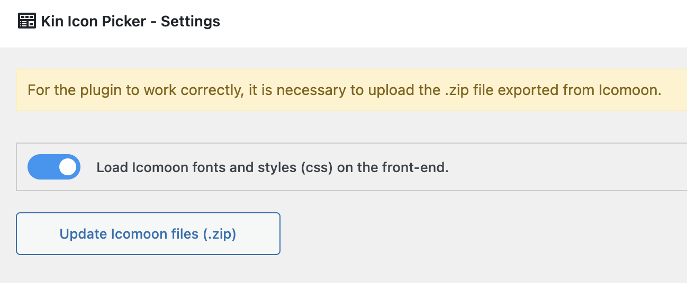

# Kin Icon Picker Field

Welcome to the Kin Picker repository on GitHub.

This plugin came from a need, it was built for personal use but, I decide to publish and hope 
this it will be useful for everyone.

## About
This plugin is an addon that works with Advanced Custom Fields plugin. It's an Icon Picker using 
[IcoMoon](https://icomoon.io/).

## Requirements
- Advanced Custom Fields
- Wordpress v5.9+
- PHP 7.4+
 
## How to use, steps:

- Access [https://icomoon.io/](https://icomoon.io/) on IcoMoon App page. 
- Create a project.

- Load the project.

- Import your SVG icons.

- Select all icons that you want to download.

- Click on Generate font button.

- Download the package (.zip).

- Upload the .zip file on the Kin Icon Picker settings page and choose if there is a need 
of loading the fonts and styles(.css) on the front-end, if you have already loaded, leave 
this field unchecked.

- Create/register the field.

- After all set, this is how looks like.

